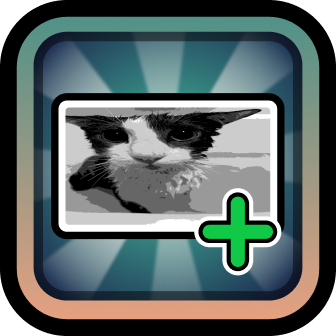

   
   <h3 align="center">ImagePlus</h3>
   

      API mod that adds more image formats
   

## About

This mod allows developers and texture pack creators to use additional image formats like:

- WebP
- JPEG XL
- GIF
- QOI

It supports both static images and animated ones, without the need for additional code (you can use this with CCSprite
or even geode::LazySprite without any issues).

## For Developers

This mod has an API that allows you to decode images directly into RGBA buffers, as well as encode them back to various
formats.

It also provides a way to control the playback of animated images, allowing you to pause, stop, resume and control the
playback speed of animated images.

## Libraries

This mod uses the following libraries:

- [libwebp](https://chromium.googlesource.com/webm/libwebp)
- [qoi](https://github.com/phoboslab/qoi)
- [stb_image](https://github.com/nothings/stb)
- [spng](https://github.com/randy408/libspng)
- [miniz](https://github.com/richgel999/miniz)
- [libjxl](https://github.com/libjxl/libjxl)

## License

This mod is licensed under the MIT License. See [LICENSE.md](LICENSE.md) for more details.